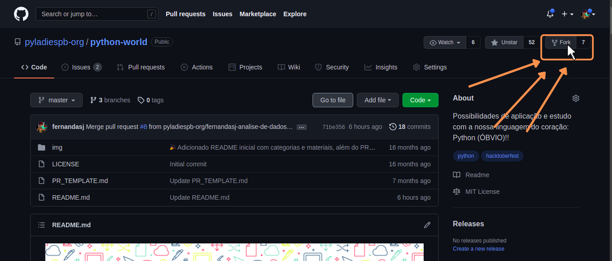
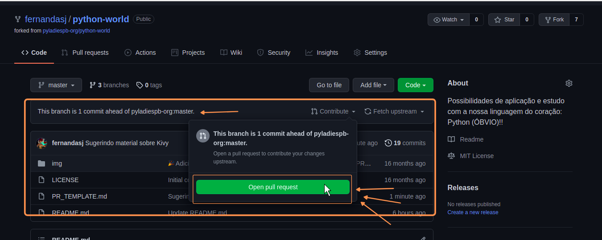
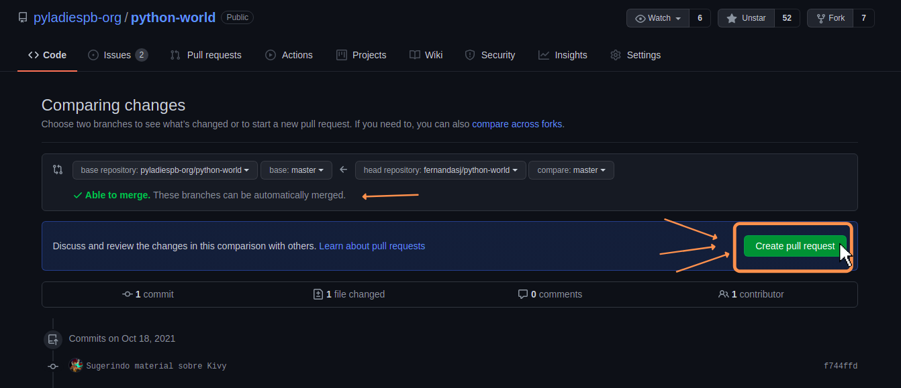
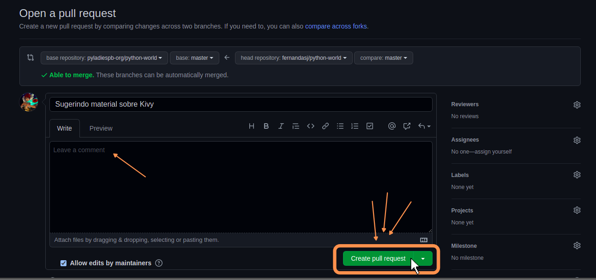
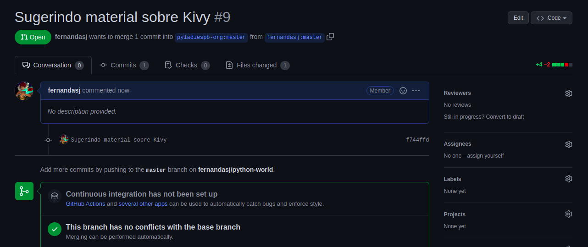

# 

## *Nós acreditamos que você consegue fazer o que quiser! :heart:*

# Por que eu devo contribuir?

A criação desse repositório só foi possível com o esforço das nossas Ladies, que pesquisaram muuuuito e montaram essa lindeza para vocês!! Incrível, né??

A sua contribuição é muito importante, pois além de compartilhar conhecimento com outras pessoas, também irá fortalecer a nossa comunidade, que fica linda a cada dia!! Então, se tu conhece algum material ou tópico que não está listado no repositório, por favor, nos envie a sua contribuição e sinta nosso abraço no seu coraçãozinho! :heart:

# Como contribuir?

O *Git* é um "sistema de controle de versão" usado para acompanhar mudanças em arquivos ao longo do tempo para que você possa recuperar versões específicas mais tarde. Além de armazenar seus códigos de forma segura, para que outras pessoas posam estudar e evoluir seus projetos.

## Instalando o Git

__Windows:__

Você pode baixar o Git em [git-scm.com](https://git-scm.com/downloads). Você pode clicar "próximo" ou "Avançar" em todas as etapas seguintes, exceto em duas delas: na etapa onde se pede para que escolha o seu editor, você deve escolher Nano, e na etapa "Ajustando o seu ambiente PATH", escolha "Usar Git e ferramentas opcionais Unix para Prompt de comando Windows" (a opção de baixo).

__Debian ou Ubuntu:__

Abra um Terminal e digite:
```
$ sudo apt install git
```

*(Para mais opções de sistemas operacionais você pode conferir [aqui](https://tutorial.djangogirls.org/pt/deploy/#instalando-o-git))*

# Conta no Github

Para utilizar o Github é preciso criar uma conta na plataforma, se você ainda não tem, corre pra criar uma agorinha! É só acessar o [site](https://github.com/) e fazer o seu cadastro! 

# Autenticação no git

Conta criada, agora é hora de fazer a autenticação no seu computador, para vincular o seu perfil do Github.

*__Lembrando que, a autenticação só precisa ser feita uma vez. Então, se você fez isso antes, é só pular esta etapa__*.

1 - Abra um terminal(Linux) ou Prompt(Windows) e digite:


```
$ git config --global user.name "Seu Nome Aqui"
```
2 - Feito isso, digite:
```
$ git config --global user.email seuEmailDoGithub@exemplo.com
```

# Fork do repositório

Git configurado, agora é a hora fazer __Fork__ do repositório, isso quer dizer que você vai fazer uma cópia do repositório original (nesse caso, o *PythonWolrd* da PyLadiesPB) para a sua conta no GitHub, dessa forma você não irá modificar diretamente o repositório original, isso evita vários problemas. Vamos lá?

O __Fork__ pode ser feito direto no navegador, como mostrado na imagem:

# 

Após clicar em __Fork__, o GitHub fará o resto para você. Quando tudo terminar, você poderá visualizaro o *PythonWorld* em sua lista de repositórios, com referência para o repositório original.

Note na imagem a seguir o resultado do __Fork__:

# 

# Clone do repositório

O próximo passo é fazer __Clone__ do repositório. Isso fará com que você tenha acesso aos arquivos do repositório no seu computador, e dessa forma, poderá fazer testes/alterações. Depois desse passo, você poderá incluir o material que acredita ser legal para o *PythonWorld*.

Para isso, iremos utilizar novamente o terminal/CMD. Porém, antes precisamos copiar o link do nosso repositório, portanto, certifique-se de estar no repositório resultado do Fork e não no original. Copie o link, como mostrado na imagem:

Agora no terminal, digite:

```
$ git clone linkRepositorio.com
```

Se você não tiver especificado nenhuma pasta no terminal, provavelmente o clone de ter sido feito na raiz do seu computador(Pasta pessoal/Área de trabalho). Caso não encontre, você sempre pode buscar pelo nome do repositório: *PythonWorld*.

*"E se eu quiser especificar uma pasta?"*

Você deve entrar nessa pasta antes de fazer o __Clone__.
Linux/Windows:

```
$ cd nomeDaPasta
```
__(Tenha em mente o caminho da pasta que deseja e o caminho em que você está, para que o comando funione)__

# Preparando contribuição

Estamos quase lá!! Respire, se hidrate, e se necessário faça uma pausa para o lanche :pizza: 

O próximo passo é adicionar sua sugestão de material! :tada:

Dentre os arquivos do repositório, você vai abrir o __PR_TEMPLATE.md__ e prenchê-lo de acordo com o materiral que deseja sugerir. Para isso, utilize um editor de texto (Ex: Visual Code, Sublime, etc). Alterações feitas? Lembre de salvar o arquivo!

# Commit e Push da contribuição

Certo, é hora de subir as suas alterações para o GitHub!

No Terminal/CMD, digite:

```
$ git status
```
Esse comando mostra todos os arquivos modificados, certifique-se de que somente o __PR_TEMPLATE.md__ seja alterado. Feito isso, digite:

```
$ git add PR_TEMPLATE.md
```
Esse comando irá adicionar o arquivo __PR_TEMPLATE.md__ ao nosso *commit*. Entenda __commit__ como uma pasta de alterações que deve ser enviada para o GitHub. Vamos criar nosso commit agora mesmo:

```
$ git commit -m "Sugerindo material sobre <seu material aqui>"
```
Substitua os <> da mensagem acima para que descreva o material que você está sugerindo. Lembre-se que as aspas devem permancer no início e fim da mensagem, certo?

*Commit* criado é hora de enviá-lo ao GitHub:

```
$ git push origin master
```
Feito isso, o GitHub irá solicitar seu username e senha. Se você está utilizando Linux, é normal que a senha não apareça visivelmente enquanto digita. Se ocorrer tudo certo com o ocmando, você poderá ver algo do tipo:

# Pull Request da contribuição

Agora que você enviou as suas alterações para o GitHub, é hora de enviar sua sugestão de alterações para nós!!

Lembre que, você está alterando uma cópia do nosso repositório, então não temos conhecimento sobre sua contribuição ainda. Para isso, é necessário a criação de um __Pull Request__ para o nosso repositório original [PythonWorld](https://github.com/pyladiespb-org/python-world), dessa forma, iremos conseguir visualizar sua sugestão.

Abrindo o seu repositório, você vai ver que o __GitHub__ já percebeu que há mudanças com potencial para uma contribuição no *PythonWorld*, legal né?!

Clique no botão para abrir a sua __Pull Request__, como mostrado na imagem:

# 

Agora é hora de revisar as suas alterações e se tudo estiver certo, crie a sua __Pull Request__!
Caso haja algum conflito o GitHub irá avisar automaticamente descrevendo o problema com as possíveis soluções, pode ficar tranquila :massage:

# 

Estamos quase lá!!

Nesta estapa, você pode escrever algum comentário sobre a sua contribuição, como por exemplo: uma descrição adicional sobre o material ou algo que você acha relevante nos contar sobre ele :speech_balloon:

Certo, respire fundo :massage:

Você está prestes a fazer sua primeira __Pull Request__!!

Simbora??

# 

3... 2... 1... :tada: :tada:


# 

YAY!! Agora, você oficialmente é uma Ladie que contribui para a comunidade *Open Source* :heart:


A partir de agora, é só esperar sua contribuição ser analizada e aprovada por alguma da nossas Ladies responsáveis.

Estamos muito orgulhosas de você e gratas pela sua contribuição, ficamos muito felizes em ver esse projeto crescer e ajudar váaaarias outras Ladies :heart:

# Dúvidas?

Contate-nos em nossas redes para esclarecer suas dúvidas.
E lembre-se: toda dúvida é importante!
Combinado?? Combinado!

Instagram: [@pyladiespb](https://www.instagram.com/pyladiespb/)

Email: pb@pyladies.com

## Fim! :heart:

